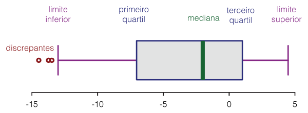

# Revisão séries temporais 
* __Definição__: Observações contidas em em um período de tempo (dados de sensores, preços de ações , eletrocardiograma , vendas de uma loja, número de usuários em uma plataforma)

* __Componentes__: 
    * Tendência : padrão longo em uma série (crescendo ou decrescendo)
    * Sazonalidade :  flutuações regulares
    * Ciclicidade : movimentos conhecidos ao longo de uma tendência
    * Erro/ Irregularidade : componente imprevisível (resíduo)  

* __Cross-section data__ : coleção de dados relativos a diferentes variáveis  de diferentes fontes providos em um período particular de tempo

# Anomalia

* Algo que desvia do normal , ou sea , uma observação que é contraditória com os dados 

## Tipos de anomalias:

* Anomalias pontuais : ponto específico que não tem relação com o dataset (ex- saque incomum em uma conta bancária)
* Anomalias contextuais : anomalia ocorre em determinadas circunstâncias  (em um específico período de tempo ou algo do tipo)
* Anomalias coletivas : coleção de observações anômalas

## Métodos de se Identificar anomalias:

### 1-) Box Plot

* Ferramenta da estatística descritiva
* Componentes:  Limite inferior , limite superior , Q1, Q3 , mediana 
* Outliers:  abaixo de Q1 -1,5* iqr ou acima de Q3 + 1,5* iqr
    * sendo iqr : Q3 - Q1
    * obs : a literatura diz que é o multiplicador é 1.5, mas nada impede de mudá-lo 

### 2-) AnomalyDetection R package 
* algoritmo : Seasonal Hybrid ESD (S-H-ESD) 
* encontra anomalias locais e globais
* é possível  especificar a direção das anomalias

### 3-) PCA (Principal Component Analysis) 

* Técnica de redução de dimensionalidade

### 4-) Chisq Square distribution

* Distribuição com mínimo de 0 e máximo infinito

### 5-) Machine Learning e Deep learning
* Supervisionado : anomalias rotuladas , utiliza-se redes neurais, svms, DT, redes Bayesianas, KNN
* Não supervisionado :  self-organizing maps (SOM), K-means, C-means,   expectation-maximization meta-algorithm (EM), adaptive resonance theory (ART),  
    * além do aprendizado por representação , como falado anteriormente (PCA), e outras técnicas de clusterização
* Deep Learning : auto encoders
